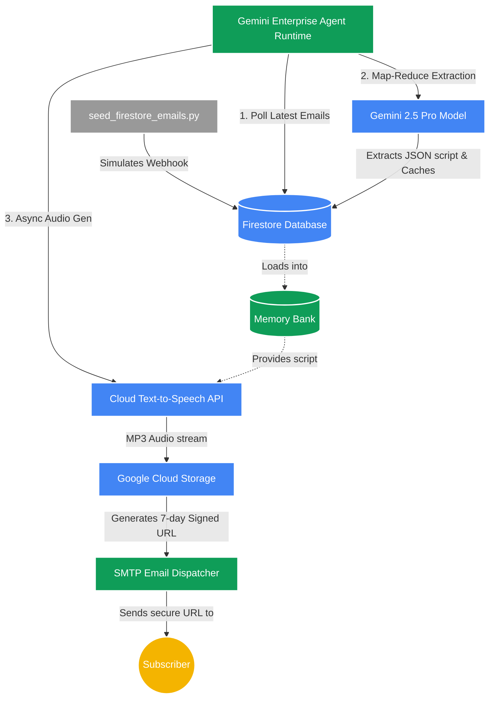

# 🎙️ Wall Street Journal Front Page Automated Podcast Agent

An enterprise-grade, serverless autonomous agent built natively on the **Gemini Enterprise Agent Platform** using the **Agent Development Kit (ADK)** (`google.adk`) and deployed to the **Gemini Enterprise Agent Platform Runtime**. 

This agent acts as an Editorial Assistant and Financial AI Producer to autonomously ingest Wall Street Journal front-page emails from a Firestore event database, perform Map-Reduce text extraction, generate studio-quality conversational podcast briefings using the **Google Cloud Text-to-Speech API**, and distribute time-limited secure signed streaming links.

---

## 🏛️ System Architecture & Flow

This diagram outlines the end-to-end flow from database ingestion to secure delivery, illustrating the orchestration layer, enterprise storage, and external API integrations.

### Mermaid Architecture Diagram



### End-to-End Operational Flow
1. **Ingestion**: The agent triggers the `ingest_firestore_emails` tool to retrieve the 5 most recent front-page news items securely staged in the Google Cloud Firestore database.
2. **Extraction & Cleaning (Map-Reduce)**: The `parse_clean_journalistic_text` tool invokes the Gemini 2.5 Pro model. It processes the emails concurrently (Map) and weaves them into a unified, structured JSON script (Reduce). It caches this state in Firestore to bypass future LLM calls if re-run on the same day.
3. **Audio Generation**: The agent calls the Google Cloud Text-to-Speech API to synthesize a professional, studio-quality conversational MP3 briefing, utilizing **async chunking** to bypass API character limits and drastically reduce latency.
4. **Staging & Signing**: The MP3 binary is uploaded to your configured GCS bucket. The GCS client generates an HMAC-SHA256 time-bounded Signed URL (valid for 7 days) that securely bypasses GCS ACL restrictions.
5. **Dispatch**: A rich HTML email is sent to the subscriber containing the secure signed URL for immediate streaming.

---

## 🛠️ Key Technologies & GCP Services

- **Gemini Enterprise Agent Platform Runtime**: Serverless execution runtime hosting our ADK agent with managed session-based persistence.
- **Agent Development Kit (`google.adk`)**: The native Google Cloud agent SDK used to bind memory-aware tools to stateful LLM flows.
- **Cloud Firestore (`google-cloud-firestore`)**: Acts as our event-driven queuing system and state caching layer.
- **Cloud Text-to-Speech (`google-cloud-texttospeech`)**: Generates the high-fidelity professional voice audio.
- **Cloud Storage (`google-cloud-storage`)**: Stages audio files and generates secure, time-bound signed URLs.
- **Cloud Scheduler**: Triggers the serverless pipeline daily.

---

## 📂 Directory Structure

```bash
wsj_podcast_demo/
├── README.md                   # System Architecture & Playbook (this file)
├── requirements.txt            # Pinned Python Dependencies
├── .env.example                # Configuration environment template
├── seed_firestore_emails.py    # Simulates an external webhook writing data to Firestore
├── run_pipeline.py             # Demonstration script for local execution
├── deployment/
│   ├── deploy.py               # Deploys ADK Agent as a serverless Runtime Engine
│   └── schedule_pipeline.sh    # Provisions a Cloud Scheduler daily cron trigger
└── wsj_podcast_agent/
    ├── __init__.py             # Module initialization
    ├── agent.py                # Core ADK Agent & stateful Memory Bank Tools
    ├── services.py             # Firestore, Async TTS, GCS, & SMTP clients
    ├── synthetic_data_generator.py # Gemini news engine
    └── tools/                  # ADK Modular Tools
```

---

## 🚀 Quick Start & Execution Playbook

### 1. Local Workspace Setup
```bash
# Copy the environment file
cp .env.example .env

# Install target dependencies
pip install -r requirements.txt
```

### 2. Seed the Database
Because this pipeline relies on a database queue, we first seed Firestore with synthetic emails, or you can use your real PDFs stored in GCS:
```bash
# Option A: Seed with Synthetic Emails
python seed_firestore_emails.py

# Option B: Seed with Real PDFs from GCS
python seed_firestore_pdfs.py
```

### 3. Run Local Demonstration Pipeline
Run the full end-to-end flow locally:
```bash
python run_pipeline.py
```

---

## 🌍 Managed Serverless Cloud Deployment

Deploy your agent directly to the **Gemini Enterprise Agent Platform Runtime** for managed execution.

### 1. Deploy to Runtime Engines
```bash
python deployment/deploy.py --create
```

### 2. Schedule Daily Execution
Deploy a Cloud Scheduler job to invoke your live Reasoning Engine endpoint automatically every day at 6:00 AM:
```bash
bash deployment/schedule_pipeline.sh
```
