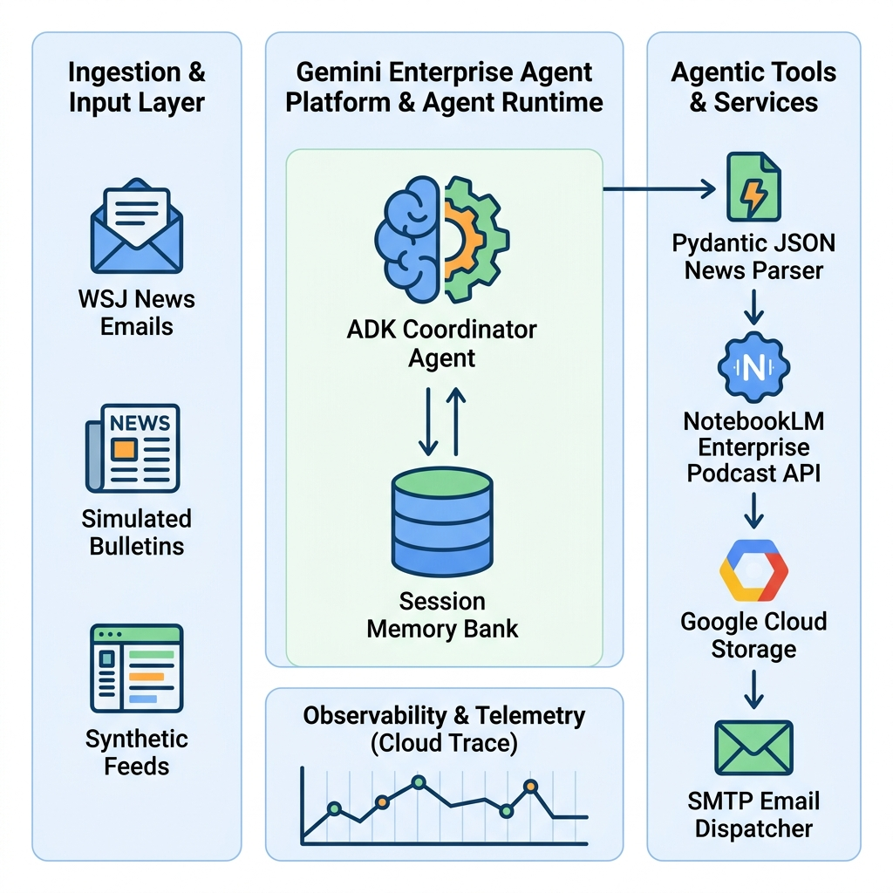

# 🎙️ Wall Street Journal Front Page Automated Podcast Agent

An enterprise-grade, serverless autonomous agent built natively on the **Gemini Enterprise Agent Platform** using the **Agent Development Kit (ADK)** (`google.adk`) and deployed to the **Gemini Enterprise Agent Platform Runtime**. 

This agent acts as an Editorial Assistant and Financial AI Producer to autonomously ingest synthetic Wall Street Journal front-page emails, strip promotional boilerplate, generate studio-quality conversational podcast briefings using the **Google Podcast API**, and distribute time-limited secure signed streaming links.

---

## 🏛️ System Architecture & Flow

This diagram outlines the end-to-end flow from ingestion to secure delivery, illustrating the orchestration layer, enterprise storage, and external API integrations.



### End-to-End Operational Flow
1. **Ingestion**: The agent triggers the `ingest_recent_wsj_emails` tool to retrieve the 5 most recent front-page news items. By default, this leverages our high-fidelity simulated news generator powered by the latest Gemini GA model.
2. **Extraction & Cleaning**: The `parse_clean_journalistic_text` tool invokes the latest Gemini GA model using the strict system prompt:
   > *"You are an editorial assistant. Here are 5 emails containing Wall Street Journal articles. Strip out all email formatting, disclaimers, and metadata. Extract only the core journalistic text."*
   This converts the raw content into a structured JSON brief featuring the clean conversational script.
3. **Audio Generation**: The agent calls the Google Podcast API (`discoveryengine.googleapis.com`) to synthesize a professional, studio-quality conversational MP3 briefing.
4. **Staging & Signing**: The MP3 binary is uploaded to your configured GCS bucket. The GCS client generates an HMAC-SHA256 time-bounded Signed URL (valid for 7 days) that securely bypasses GCS ACL restrictions.
5. **Dispatch**: A rich HTML email is sent to the subscriber containing the secure signed URL for immediate streaming.

---

## 🛠️ Key Technologies & GCP Services

- **Gemini Enterprise Agent Platform Runtime**: Serverless execution runtime hosting our ADK agent with managed session-based persistence.
- **Agent Development Kit (`google.adk`)**: The native Google Cloud agent SDK used to bind memory-aware tools to stateful LLM flows.
- **Latest Gemini GA Model**: Enterprise-tier foundation model orchestrating deep reasoning, text parsing, and pipeline steps.
- **Cloud Storage (`google-cloud-storage`)**: Stages audio files and generates secure, time-bound signed URLs.
- **Cloud Trace & Platform Observability**: Built-in tracing that automatically profiles step latencies and model tokens.

---

## 📂 Directory Structure

```bash
wsj_podcast_demo/
├── README.md                   # System Architecture & Playbook (this file)
├── requirements.txt            # Pinned Python Dependencies
├── .env.example                # Configuration environment template
├── run_pipeline.py             # Demonstration script for local verification
├── deployment/
│   ├── deploy.py               # Deploys ADK Agent as a serverless Runtime Engine
│   └── test_deployment.py      # CLI client for real-time streaming testing
└── wsj_podcast_agent/
    ├── __init__.py             # Module initialization
    ├── agent.py                # Core ADK Agent & stateful Memory Bank Tools
    ├── services.py             # Content extraction, Podcast REST API, GCS, & SMTP clients
    ├── synthetic_data_generator.py # Gemini news engine
    └── .env                    # Submodule runtime settings
```

---

## 🚀 Quick Start & Execution Playbook

### 1. Local Workspace Setup
```bash
# Copy the environment file
cp .env.example .env

# Install target dependencies
pip install -r requirements.txt
```

Configure the target GCS bucket in your `.env`:
```ini
GOOGLE_CLOUD_STORAGE_BUCKET=<YOUR_GCS_STAGING_BUCKET>
```

### 2. Run Local Demonstration Pipeline
Run the full end-to-end flow locally:
```bash
python run_pipeline.py
```

### 3. IAM Setup for Secure GCS URL Signing
Because corporate organizational policies (`constraints/iam.disableServiceAccountKeyCreation`) prevent downloading raw JSON key files, the agent uses secure **keyless Service Account Impersonation** to cryptographically sign GCS URLs.

To enable this in your environment, grant your active CLI user (`<YOUR_USER_EMAIL>`) the token creator role on the podcast agent's service account:
```bash
gcloud iam service-accounts add-iam-policy-binding \
    podcast-agent-sa@<YOUR_GCP_PROJECT_ID>.iam.gserviceaccount.com \
    --member="user:<YOUR_USER_EMAIL>" \
    --role="roles/iam.serviceAccountTokenCreator"
```

---

## 🌍 Managed Serverless Cloud Deployment

Deploy your agent directly to the **Gemini Enterprise Agent Platform Runtime** for managed execution.

### Deploy to Runtime Engines
```bash
python deployment/deploy.py --create
```

### Query the Remote Serverless Session
Once deployed, initiate an interactive, trace-monitored query stream using the returned resource ID:
```bash
python deployment/test_deployment.py --resource_id=<RESOURCE_ID>
```
All execution steps, latency, and tool invocations will automatically stream directly into **Google Cloud Trace** and **Platform Observability**!
